_Made With_ <a href="https://unity.com/"><i class="fab fa-unity"></i></a> + <a href="https://nodejs.org/"><i class="fab fa-node-js"></i></a> + <a href="https://reactjs.org/"><i class="fab fa-react"></i></a>

`youtube: https://youtu.be/x49WGPyRNkc`

### Glossary

1. [Overview](#overview)
2. [The Data + Analysis](#the-data--analysis)
3. [Using The Application](#using-the-application)
4. [Current Limitations](#current-limitations)
5. [Source & Installation](#source-and-installation)
6. [Analysis Details](#analysis-details)

## Overview

[Background](#background-vissnippets) | [New Platforms](#extending-the-analysis-workflow-to-new-platforms) | [Primary Concepts](#primary-concepts) | [Top <i class="fas fa-angle-double-up"></i>](#glossary)


### Background: VisSnippets

The VisSnippets project serves as the foundation for this Virtual Reality application. VisSnippets is a system for collaborative visual data exploration on Large Displays using the SAGE2 Middleware. VisSnippets allows users to write, in parallel, snippets of code which can be composed into branching data pipelines. Leveraging the screen real estate provided by SAGE2 on Large Displays, users can arrange their collaborative analysis across the two dimensional space.

Snippets are categorized into three primary types: Data Generation, Data Transformation, and Visualization. The types semantically separate the operation which occurs in the code. When a user chooses to compose a snippet onto an existing section of the data pipeline, the VisSnippets system creates a reactive data connection between the two blocks. Any changes to code (and data, as a result) in the pipeline will propagate to downstream branches of the analysis.

This work is scheduled to appear in the proceedings of [PEARC'20](https://pearc.acm.org/pearc20/).

`youtube: https://www.youtube.com/watch?v=8fC6FwrD20g`

Recent development on the project aims to isolate the core VisSnippets system and runtime into a self-contained module which can communicate with SAGE2 as well as other data processing or visualization platforms.


### Extending the Analysis Workflow to New Platforms

By isolating and refining the VisSnippets runtime, it is possible for it to run on multiple platforms including within the Web Browser or on a NodeJS Server backend. By placing the analysis backend on a server, the server can also expose a REST API which allows multiple client types to interact with the runtime.

The new possibilities which are opened up by this improvement are the foundation of this project. This project explores using Unity3D as a VR view client for viewing and interacting with the data analysis in a generalized, data-agnostic manner.

### Primary Concepts

#### Expressive Data Exploration

This project utilizes the VisSnippets workflow and architecture as a foundation to support expressive data exploration and analysis. Rather than predefining a set of connections between analytical building blocks in a Unity application, the goal is to support a variety of analyses with a predefined set of _types_ of operations shared between the Unity application and the backend. The flexibility of the VisSnippets system builds the foundation to bridge the analysis into a Unity application.

#### Efficient Abstraction

The flexibility in data analysis and the opportunity to support a new Unity VR application as a client are supported by _Efficient Abstraction_ included in the VisSnippets architecture.

The most important abstraction relevant to this project is the declarative API provided to snippets. VisSnippets implements and exposes API calls under the name `SAGE2.*` to the snippets which allow snippets to utilize powerful, declarative functionality within their code. This implementation can vary depending on the platform which the VisSnippets runtime is deployed on in order to maintain the intended functionality of the code.

The two methods in this scenario which are the most critical to this application are the following:

**<code style="font-size: 1.1rem;">SAGE2.VegaLiteChart</code>**

This operation creates a Vega-Lite chart for VisSnippets, predefining the size and passing the data into the method explicitly. This also renders the chart as appropriate for platform. When run in the **Browser**, the Vega-Lite chart gets rendered to a Canvas element that is displayed in the page. When run on the **Server**, the Vega-Lite chart is not rendered visibly, but is converted to a buffer and sent as an `image/png` response when the API endpoint specifying that image is requested.

```javascript
SAGE2.VegaLiteChart({
  // an array of objects
  data: myArray,
  // a partial Vega-Lite specification which defines the encodings
  spec: vegaLiteSpec,
});
```

**<code style="font-size: 1.1rem;">SAGE2.SnippetExternalOp</code>**

This operation allows a snippet to specify a mapping from the source data to a generic form which can be ingested and used in another context. In this scenario, the other context is the Unity application and this specifies a 'selection' operation on a dataset. Its format is as follows:

```javascript
var selectedValue = SAGE2.SnippetExternalOp({
  // operation name within a predefined set (future: filter)
  operation: "select",
  // a title for display purposes only
  name: "Operation Name",
  // an array of objects
  inputData: data,
  // default to the first element in the array
  defaultValue: data[0],
  // the target data format (future: xy or latlng)
  dataFormat: "xyz",
  // numbers to be mapped to the x, y, and z dimensions
  fields: ["field_A", "field_B", "field_C"],
  // a string to display as the label for each data point
  labelField: "field_name",
});
```

#### Blended Front/Back-End Architecture

As mentioned in the previous section, the API implementations which are exposed to the snippets vary slightly in order to adapt to the platform. For use in a Server, these methods are adapted to best suit the structure of a RESTful API. To achieve this blended Front/Back-End architecture, the server exposes enough information for the Unity application to be able to display and interact with the structure of the analysis.

When launched, the Unity application requests the set of `nodes` from the Server. This response includes all of the analysis blocks along with their graph positions. Additionally, this provides information about the snippet used in that block and flags for `hasImage` and `externalOperation`.

The `hasImage` flag lets Unity know that there is an Image which can be retrieved dynamically if that node of the graph is selected. In this case, this is true when the `VegaLiteChart` method was used in a snippet. Similarly, the `externalOperation` flag is set as `true` when the `SnippetExternalOp` method was used in a snippet.

With these flags, the Unity application can retrieve the image or the external operation information by using REST API endpoints on the Server. Additionally, the retrieved information is in a consistent structure regardless of the underlying details of the operation.

## The Data + Analysis

The mock analysis set up for this application uses two separate Data APIs for COVID-19 data. The application retrieves the data from two REST services to provide up-to-date information each time you run the application.

The first API (<a href="https://covid19api.com/">covid19api.com</a>) is primarily focused on country-level data. This is used to retrieve a summary of current status, by country, across the world and to retrieve time-series data for a single selected country. The second API (<a href="https://covidtracking.com">covidtracking.com</a>) is focused on the United States and is used to provide detailed information on a per-state basis.

The constructed data pipeline as it is displayed in the Editor and in Unity (mirrored vertically in relation to the Editor) can be seen here:

<table style="width: 80%; margin-left: auto; margin-right: auto;">
<tr>
<td style="width: 50%; border: none;">
<figure>
</img>
</figure>
<!--  -->
</td>
<td style="width: 50%; border: none;">
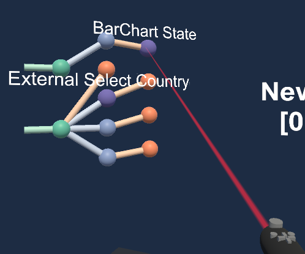</img>
<!-- .") -->
</td>

</tr>
</table>

<!-- - **Walk through the analysis pipeline in prose** -->

The analysis constructed here is divided into two distinct sections based on which API is used. We will begin with upper section as it is displayed in the _Editor_.

First, the **COVID-19 API** block retrieves a summary of cases by country which includes the number of confirmed cases, deaths, and recovered patients. Next, the **BarChart Country** block creates a chart using Vega-Lite which displays the number of cases for all countries with > 250 cases. Additionally, three parallel branches are created, each with the **External Select Country** and **VegaLite Line Chart** operation. **External Select Country** delegates a selection operation to the external client, in this case Unity, which visualizes the data within the application in 3D and will produce a single selected element. This selected element is then used to fetch historical data for that country. **VegaLite Line Chart** visualizes this time-series historical data as a line chart. Each of these three parallel branches can hold its own country selection to allow for comparison between selected values.

In the lower section of the analysis, the **US COVID-19** block retrieves current case statistics for the United States by state. The **Ext Select State** block then delegates a selection operation to Unity, using the same method described above, to select an individual state from the dataset. The selection is then visualized using the **BarChart State** snippet which produces a VegaLite bar chart for a few metrics.

More detailed information regarding any of these operations can be found in the [Analysis Details](#analysis-details) section.

## Using The Application

In this section, we will walk through the usage of the application so as to highlight important features. _Note: at times, the laser pointer is used to highlight the use of the wand but is not required to perform interactions, although it may prove to be helpful._

When the Unity application is run, the user will be presented with a dataflow graph and a set of 3D axes. This dataflow graph and accompanying information about the operations is retrieved from the VisSnippets Server when the application loads.

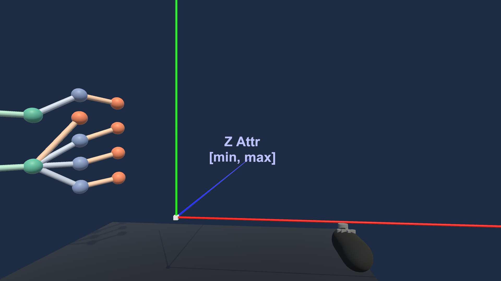

You may point the wand at any node in the graph to reveal the name of that operation. The node may then be selected to display by using the controller. This uses Button 3, i.e. the same button used to close the menu. When selecting a Visualization node (denoted with an orange color), the server-rendered image will appear to the right. In this case, a bar chart visualizing Deaths by Country was chosen.

<!--  on an orange node in the graph to show a visualization.")

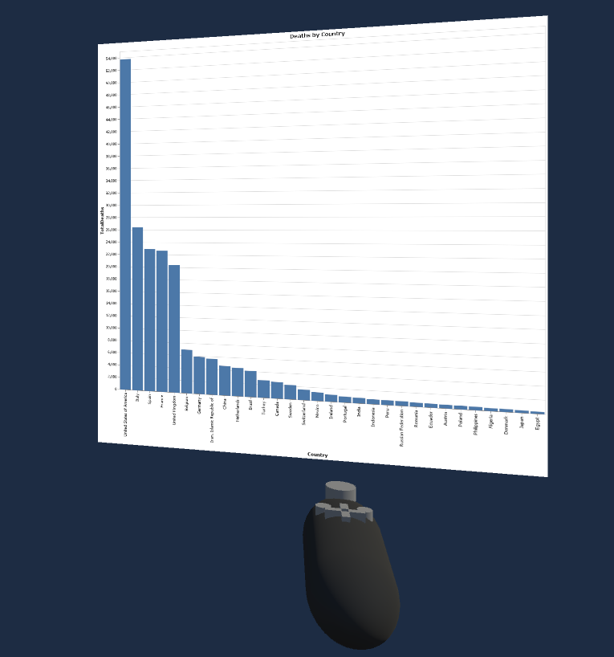 -->

<table style="width: 90%; margin-left: auto; margin-right: auto;">
<td style="width: 50%; border: none; font-size: 1rem;">
<figure>
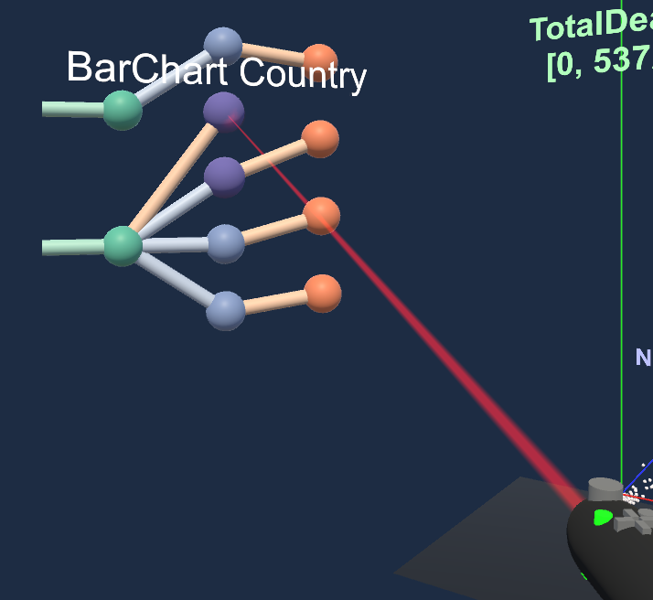</img>
</figure>
</td>
<td style="width: 50%; border: none; font-size: 0.9rem;">
</img>
</td>
</table>

Selecting a Data node (denoted with a blue color), will bring the data into Unity and visualize it in 3D space based on the attributes provided in the snippet. The X, Y and Z dimensions encode the `TotalConfirmed`, `TotalDeaths`, and `NewDeaths` attributes, respectively. The user may then view and move through the plotted data and select a data point. Selection is performed in the same way that you would select a node from the graph.

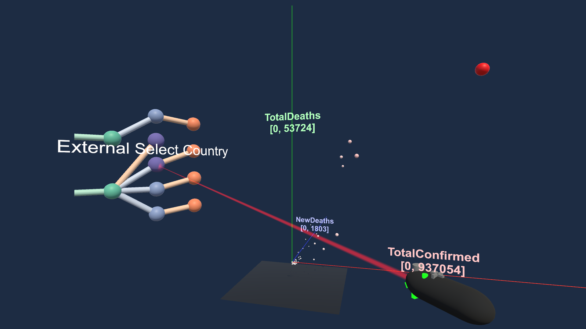

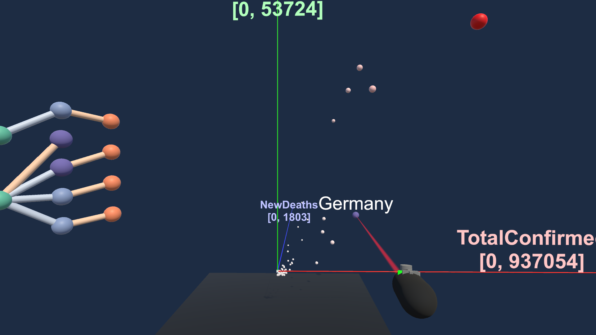

After selecting a country, the VegaLite Line Chart which uses that selection as input will have updated. _Note: Updates within the Unity application do not yet propagate automatically, and new data selections will require the user to click the desired visualization again to see the update._

<table style="width: 90%; margin-left: auto; margin-right: auto;">
<td style="width: 50%; border: none; font-size: 1rem;">
<figure>
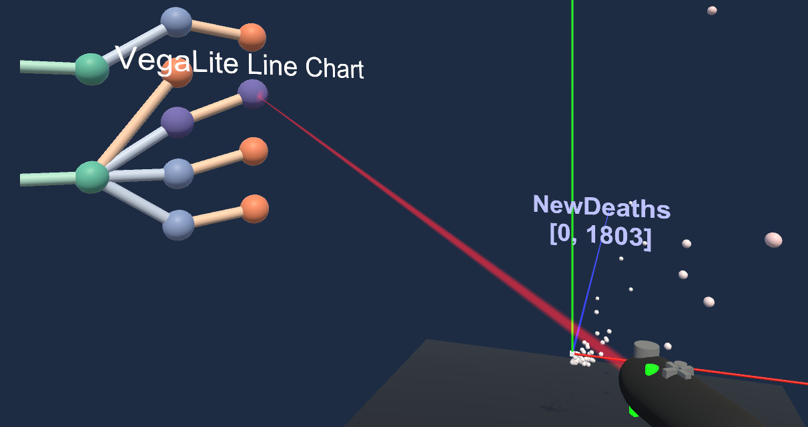</img>
</figure>
</td>
<td style="width: 50%; border: none; font-size: 0.9rem;">
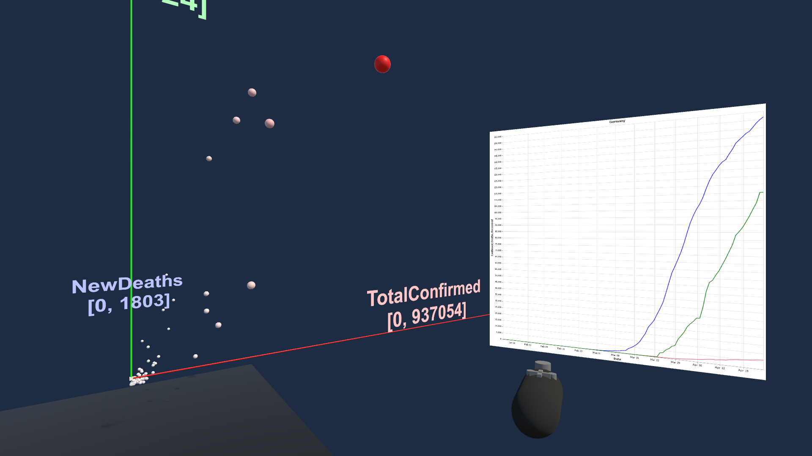</img>
</td>
</table>

By opening the menu, you can choose a new attribute to encode using the size and color of each sphere. By double or triple encoding a chosen value, this can help to mitigate weak depth cues when viewing the data from certain angles. Additionally, using color alongside size helps to disentangle the Size from the Depth channel. The hue of the data point indicates which spatial axis attribute is also being encoded through color and size (e.g. a Blue hue indicates the Z axis attribute, a Red hue indicates the X axis attribute).

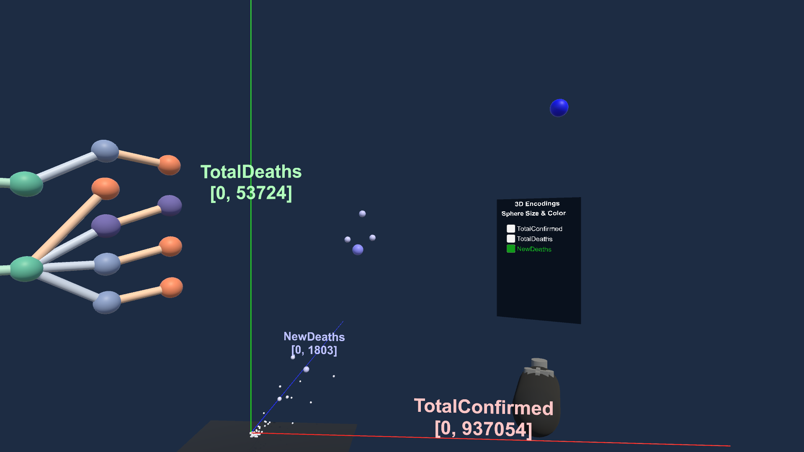

As discussed in the [Efficient Abstraction](#efficient-abstraction) section, the declarative methods provided to the snippets provide efficiency as well as reusability and a generalization of functionality. This allows common behavior to be achieved for data of a different format or in a context with a different goal. Below, we can see the **Ext Select State** node being selected and that data being plotted in 3D within Unity. However, this dataset is being plotted in 3D using a different set of attributes. This snippet defined the X, Y, and Z dimensions to encode the `totalTestResults`, `positive`, and `negative` attributes, respectively.

In both cases, the Unity application did not have explicit knowledge of the data which was going to be visualized. Instead, the VisSnippets architecture and the Unity application both agree on a common, generalized data format that can be ingested by Unity. [This data format can be seen here](https://github.com/AndrewTBurks/528P2_Burks/blob/dev/Assets/MyScripts/ExternalOperationManager.cs#L264).

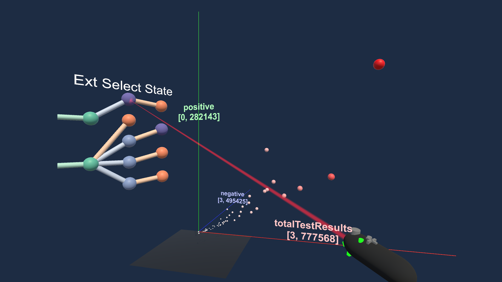

Similar to how a Country could be selected, the user may select a State and view their selection using the **BarChart State** snippet.

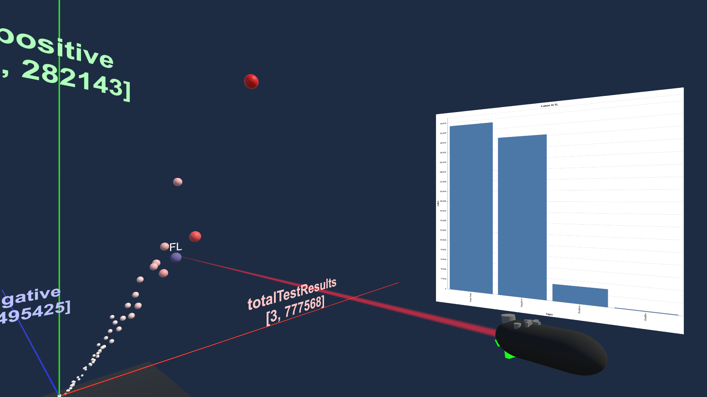

Lastly, the 3D Encodings menu dynamically updates to display new options based on a data element's attributes.

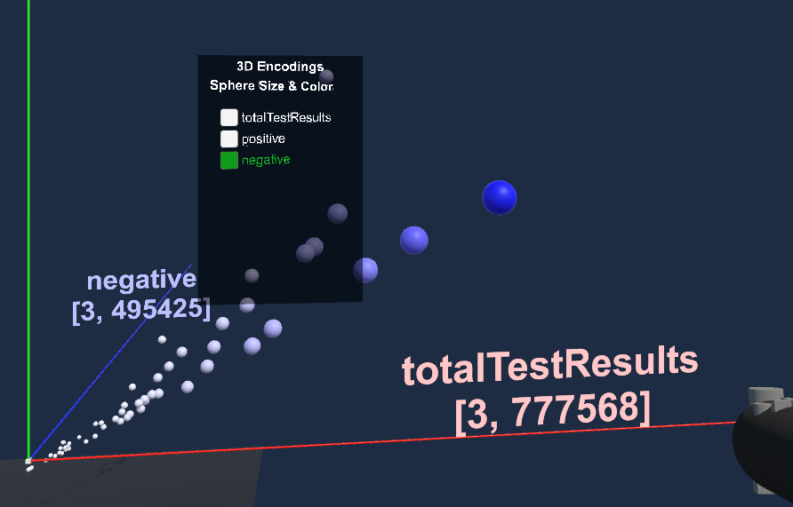

## Current Limitations

At the current stage of this project, a basic client-server architecture is functional and the analysis is transferrable between platforms. With this foundation in place, the Unity application can be extended further to support more complex interaction, either within the application or between the application and the analysis.

The primary shortcoming of the current implementation is the limited communication between the workspace, server, and Unity application. Currently, the configuration produced within the VisSnippets workspace needs to be manually added as the server configuration. When transitioning from the Workspace to the Server, there are currently issues with external dependency management that need to be addressed in terms of differences between browser dependencies and server-side dependencies.

In regards to the VR application, it could benefit further from Server-Sent Messages which allow the VisSnippets Server to push updates to the Unity application. As it currently stands, a user must reselect a chart which is already visible to receive an updated version when the data that backs the chart changes.

Lastly, the Unity VR application could be further extended to support more complex tasks and better provide users **"space-to-think"** by allowing content to be arranged throughout space, either as billboards or situated alongside spatialized data.

Of course, this dataset wasn't inherently spatial and thus did not benefit greatly from the use of 3D and VR but it does illustrate the concept.

### Future Extensions

The most important extension of this work is to provide more interactivity to the Unity VR application. As it stands, it is relatively interactive but these interactions mostly relate to selecting data to view or to relay back to the server. An ability to rearrange content would make this more compelling.

Additionally, finding a domain science use case could be interesting as well. It would likely be a domain with plenty of spatial data in which spatial-nonspatial visual integration is important.

Lastly, it would be nice to allow the Unity application to apply new analyses onto the existing data pipeline. However, it is debatable whether or not a user could efficiently and effectively perform this action in VR as there is much nuance to which snippets can be applied to others based on the data input and output. Due to this factor, the task of manipulating the analysis pipeline structure may be better suited to remain in the VisSnippets Workspace.

## Source and Installation

**_Note: This Unity Application currently requires the backend to feed it data, so the Unity application will be blank without a server set up to handle requests. The backend is closed-source, but you should be able to examine the generalized Unity front-end code._**

### Unity Application

#### [**GitHub** @AndrewTBurks/528P2_Burks <i class="fab fa-github"></i>](https://github.com/AndrewTBurks/528P2_Burks)

To _Download_ the application, clone the repository locally and add the project to UnityHub or open it in Unity using **Version 2019.2.11f**.

By default, the project should be configured to run on Desktop using the CAVE2 Simulator from the module-omicron Unity3D plugin. To configure to run for Vive, go to the Omicron menu and select **Configure for Vive**. Similarly, to run in CAVE2, return to the same menu and select **Configure for CAVE2** and follow the [rest of the build/run steps](https://github.com/uic-evl/omicron-unity/wiki/Guide-for-running-Unity-in-CAVE2#building-on-cave2).

**Note: Due to COVID-19, this application has not been tested using the Vive or CAVE2 at this time. Continue on those platforms at your own risk!**

All Assets and packages required should be included in the repository, and the Library folder should rebuild when opened in Unity.

### VisSnippets Frontend + Backend

The source for the VisSnippets Frontend and Backend described are currently closed-source as of the creation of this post. If you would like to learn more, please reach out to me directly.

## Analysis Details

<div class="content-warning">Warning: Your screen may not be wide enough to properly view the table below (recommended: >850px)</div>

The table below outlines the specific set of operations put together to form the data pipeline seen in the application.

<table class="code-table">
<thead>
<th>Name</th>
<th>Code</th>
</thead>
<tbody>
<tr>
  <td>COVID-19 API 
    <div class="description">
      Fetch COVID-19 current cases by Country from <a href="https://covid19api.com/">covid19api.com</a>
    </div>
  </td>
  <td>

```javascript
var requestOptions = {
  method: "GET",
  redirect: "follow",
};
var url = "https://api.covid19api.com/summary";

fetch(url, requestOptions)
  .then(res => res.json())
  .then(next);
```

  </td>
</tr>

<tr>
  <td>BarChart Country
    <div class="description">
      Create a bar chart with VegaLite that shows the total deaths per country for countries with > 300
    </div>
  </td>
  <td>

```javascript
const date = {
  x: {
    field: "Date",
    type: "temporal",
  },
};

const yField = name => ({
  field: name,
  type: "quantitative",
  scale: {
    zero: "true",
  },
});

let spec = {
  title: "Deaths by Country",
  // below is the custom visualization specification
  transform: [
    {
      filter: "datum.TotalDeaths >= 300",
    },
  ],
  mark: {
    type: "bar",
    filled: true,
  },
  encoding: {
    x: {
      field: "Country",
      type: "nominal",
      sort: "-y",
    },
    y: yField("TotalDeaths"),
  },
};

SAGE2.VegaLiteChart({
  data: data.Countries,
  spec,
});
```

  </td>
</tr>

<tr>
  <td>External Select Country
    <div class="description">
      Specify an External "select" operation using an XYZ encoding with the specified fields. Next, fetch time-series data for the selected country from <a href="https://covid19api.com/">covid19api.com</a>
    </div>
  </td>
  <td>

```javascript
var country = SAGE2.SnippetExternalOp({
  operation: "select",
  name: "Select Country",
  defaultValue: data.Countries[20], // some default value
  inputData: data.Countries,
  dataFormat: "xyz",
  fields: ["TotalConfirmed", "TotalDeaths", "NewDeaths"],
  labelField: "Country",
});

fetch("https://api.covid19api.com/country/" + country.Slug)
  .then(res => res.json())
  .then(next);
```

  </td>
</tr>

<tr>
  <td>Vega-Lite Line Chart
    <div class="description">
      Visualize the time-series data for a country using a Line Chart built with Vega-Lite
    </div>
  </td>
  <td>

```javascript
const date = {
const yField = name => ({
  field: name,
  type: "quantitative",
  scale: {
    zero: "true",
  },
});

const layer = (name, color = "blue") => ({
  mark: {
    type: "line",
    filled: false,
  },
  encoding: {
    x: {
      field: "Date",
      type: "temporal",
    },
    y: yField(name),
    color: {
      value: color,
    },
  },
});

let spec = {
  title: data[0].Country,
  // below is the custom visualization specification
  layer: [
    layer("Confirmed"),
    layer("Deaths", "#db646f"),
    layer("Recovered", "green"),
  ],
};

SAGE2.VegaLiteChart({
  data,
  spec,
});
```

  </td>
</tr>

<tr>
  <td>US COVID-19
    <div class="description">
      Retrieve data per state from <a href="https://covidtracking.com">covidtracking.com</a>
    </div>
  </td>
  <td>

```javascript
fetch("https://covidtracking.com/api/states")
  .then(res => res.json())
  .then(next);
```

  </td>
</tr>

<tr>
  <td>Ext Select State
    <div class="description">
      Specify an External "select" operation using an XYZ encoding with the specified fields
    </div>
  </td>
  <td>

```javascript
var state = SAGE2.SnippetExternalOp({
  operation: "select",
  name: "Select State",
  defaultValue: data.find(s => s.state === "IL"),
  inputData: data,
  dataFormat: "xyz",
  fields: ["totalTestResults", "positive", "negative"],
  labelField: "state",
});

next(state);
```

  </td>
</tr>

<tr>
  <td>BarChart State
    <div class="description">
      A Bar Chart of case info (tests, negative, positive, deaths) for a single state
    </div>
  </td>
  <td>

```javascript
const chartData = [
  {
    type: "Total Tests",
    value: data.totalTestResults,
  },
  {
    type: "Negative",
    value: data.negative,
  },
  {
    type: "Positive",
    value: data.positive,
  },
  {
    type: "Deaths",
    value: data.death,
  },
];

let spec = {
  // below is the custom visualization specification
  title: "Cases in " + data.state,
  mark: {
    type: "bar",
    filled: true,
  },
  encoding: {
    // column: {}
    x: {
      field: "type",
      type: "nominal",
      sort: null,
    },
    y: {
      field: "value",
      type: "quantitative",
    },
  },
};

SAGE2.VegaLiteChart({
  data: chartData,
  spec,
});
```

  </td>
</tr>

<!-- <tr>
  <td>Name
    <div class="description">
      Description go Here
    </div>
  </td>
  <td>

```javascript
```

  </td>
</tr> -->

</tbody>
</table>
