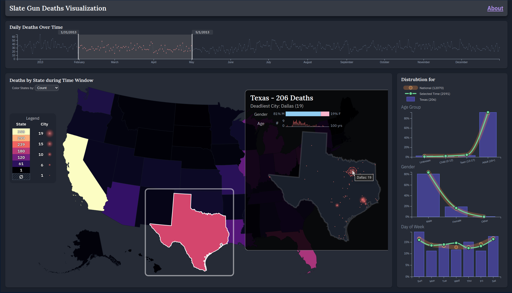
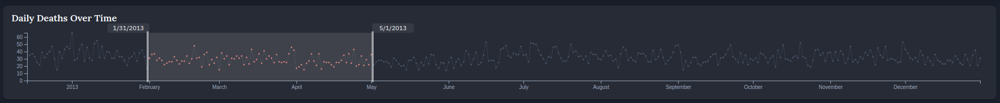
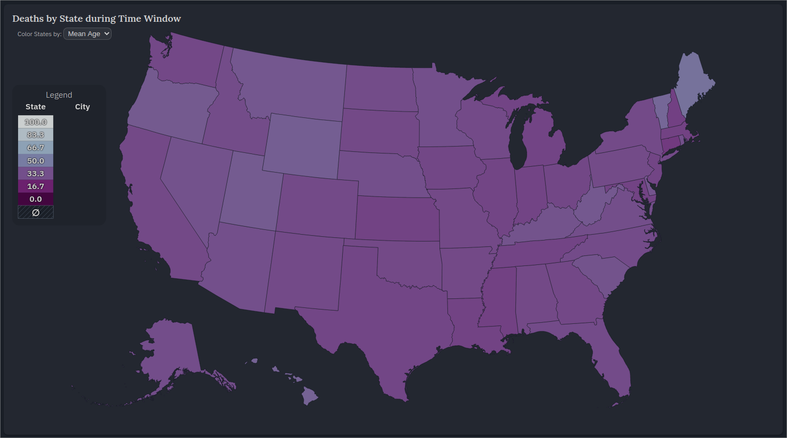
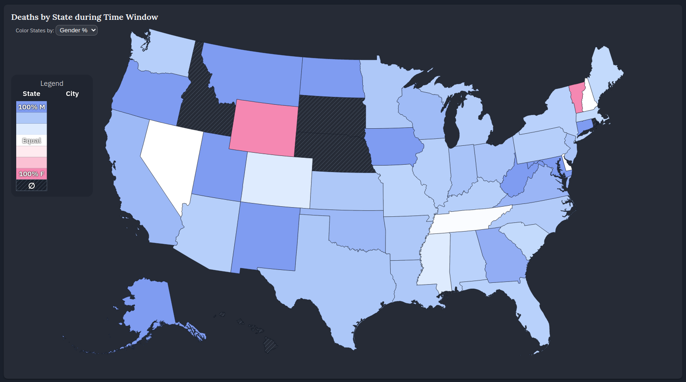
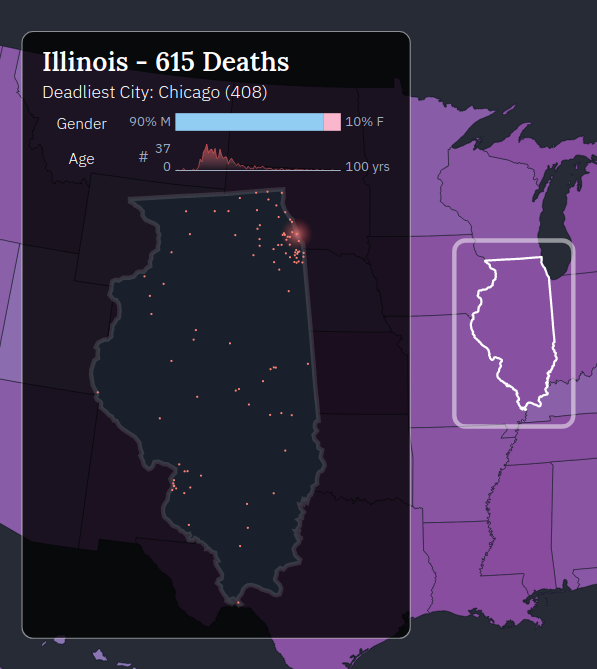
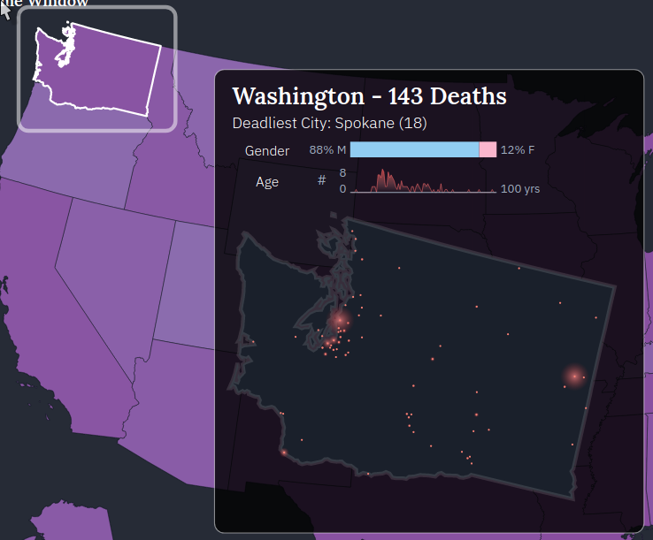
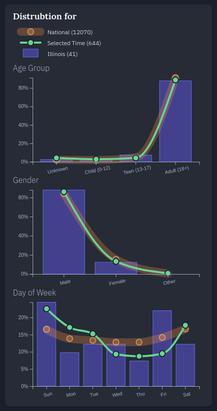

**[Link to the Slate Gun Deaths Visualization](https://sgd.andrewtburks.dev)**

## Overview

This application visualizes gun deaths in the United States from _Dec. 14, 2012 to Dec. 31, 2013_. The data is provided by Slate and is available to download from the article [How Many People Have Been Killed By Guns Since Newtown?](http://www.slate.com/articles/news_and_politics/crime/2012/12/gun_death_tally_every_american_gun_death_since_newtown_sandy_hook_shooting.html)
The tool allows you to explore temporally and across scales, drilling down to see data from a specific time period and state. You may also compare the distribution of the selected subset against the Nation.

## Visual Design and Interaction

This tool is designed to be highly interactive and to visualize an appropriate level of aggregation at different levels of analysis. There are 4 main views in the tool: the **Timeline**, the **Map**, the **State Overlay**, and the **Distributions**.

Selections made in the **Timeline** propagate through the rest of the views. When a time window is selected in the Timeline, the Map and State Overlay will update to show data only within that time range, and the _Selected Time_ series in the Distributions view will update. Selecing a state on the **Map** acts to open the State Overlay and show detailed information about gun deaths in that state. Additionally, the _Selected State_ series in the Distribution view updates with the newly selected state.
As a user makes selections, new aggregates for each view are computed interactively from the full dataset.

### Timeline

The **Timeline** view plots the daily gun deaths over time and supports a brushing opertaion to select a time range for the other views.

### Map

The **Map** view allows a user to choose one of three attributes to plot gun deaths by state:

- Total Count _(can be seen in the image at the top of the page)_
- Mean Age _(first image below)_
- Gender Proportion _(second image below)_

### State Overlay

The **State Overlay** shows more details about the state which was selected on the map for the selected time range. This information includes the:

- total count of deaths,
- deadliest city and its death total,
- gender distribution of deaths,
- age distribution of deaths, and
- location and total count by city plotted across the state

For the state map, the size of the circle encodes the count for that city.

### Distributions

The **Distributions** view supports comparison of the data distribution for 3 attributes: **Age Group** (as defined by Slate), **Gender**, and **Day of Week**.

In a chart for each attribute, we can see the distribution at the **National** level (thick orange line), the National level for the **Selected Time** (green line), and the **State** level for the current time window (purple bars).

## Sources

#### Data

- Slate Gun Deaths (CSV): [How Many People Have Been Killed By Guns Since Newtown?](http://www.slate.com/articles/news_and_politics/crime/2012/12/gun_death_tally_every_american_gun_death_since_newtown_sandy_hook_shooting.html)
- 10m State-level Shapefiles: [@topojson/us-atlas](https://github.com/topojson/us-atlas)
- Favicon: [favicon.io](https://favicon.io/emoji-favicons/pistol/)

#### Libraries

- [@topojson/topojson-client](https://github.com/topojson/topojson-client)
- [d3.js](https://d3js.org)
