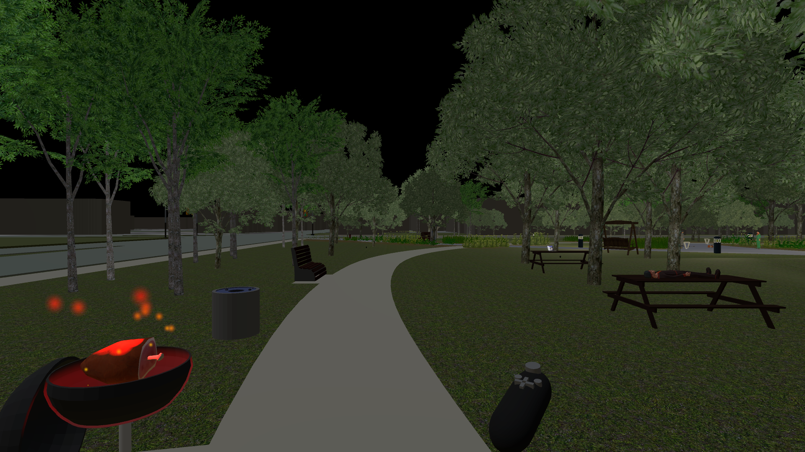
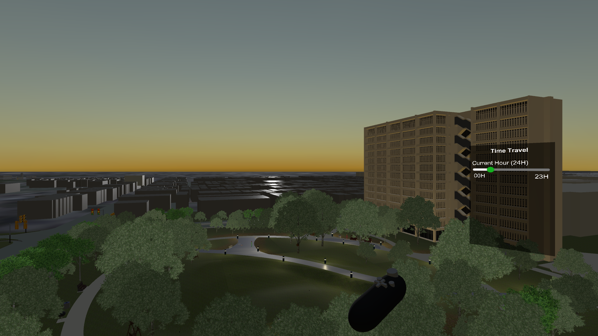
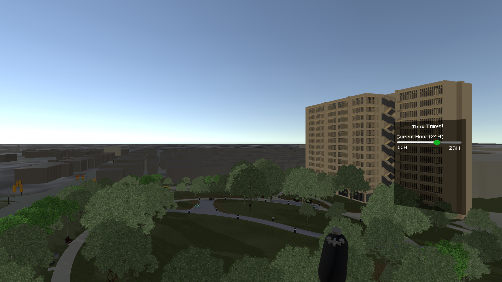
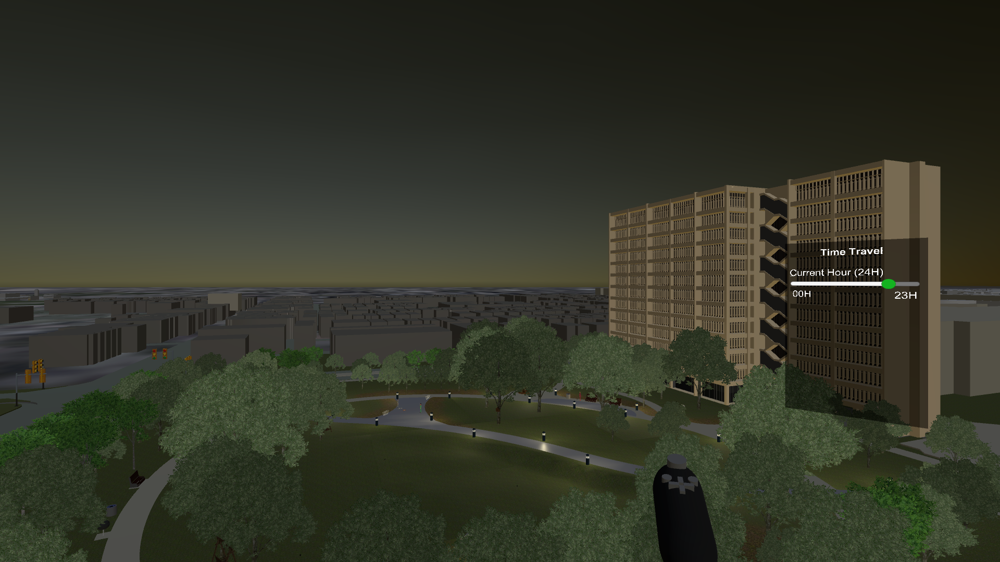
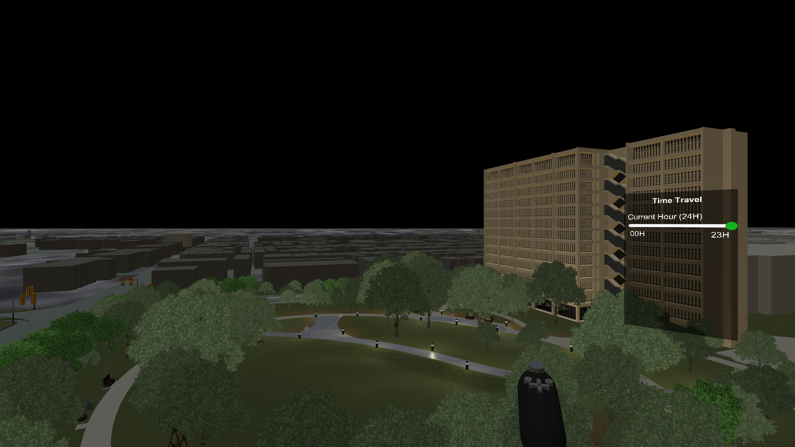

_Made With_ <i class="fab fa-unity"></i>

`youtube: https://www.youtube.com/watch?v=2Xc9gXyf2G4`

### Glossary
1. [The Application](#the-application)
2. [The Data](#the-data)
3. [Source & Installation](#source-and-installation)
4. [CAVE2 vs. VIVE vs. Reality](#comparison)

## The Application

### Interaction

This VR world supports **two** explicit interactions with the controller _(both using the X button in CAVE2, left click on PC, or equivalent on VIVE)_.

The first interaction turns on and off the grill. When the user interacts with the grill, the top opens and hangs on the side and a sound effect plays ([Sound #5](#sounds)). Additionally, a red light shines on the grill and  a red particle effect emulating fire plays along with an accompanying fire sound effect ([Sound #6](#sounds)).

, currently in the ON state, with two sprinklers visible nearby (left).")

The second interaction controls the sprinkler system. When a user interacts with the control box (above), all of the sprinklers across the Grove will turn on (seen below). Each sprinkler consists of a custom model, a particle system, and a sound effect ([Sound #1](#sounds)). 

.")

The dog who is on high alert for criminals at night will watch you carefully as you move through the scene, barking if you get too close ([Sound #10](#sounds)). 

### Animation

To give the feeling of an active environment, the bus on Taylor St. (south side of grove) and two cars on Morgan St. (west side of grove) are animated to drive by periodically. The Morgan St. vehicles loop continously, while the bus stops at the intersection, then continues westbound on Taylor St. These vehicles all carry a spatialized sound effect which moves along with them during their animation ([Sound #4](#sounds)).

### Travelling

#### Through Space ...

Through the Warp menu, the user can choose to jump to **4** different locations throughout the scene. The first location is the **Center** of the grove where the user starts. The user can also choose to warp next to the **Fountain**, the intersection of **Taylor & Morgan**, or to the **Picnic Area**.

#### ... and Through Time

The position of the directional light in the scene is calculated for the current day that the application is running. For example, running the application on February 17th will start with the sun's position as it would be at around 1:30pm that day. The Time menu does not contain only day and night, but rather contains a time range. When the time is changed, the sun's position will update appropriately. The **Day** scene exists between 7am and 6pm and the **Night** scene exists the rest of the time: 6pm to 7am. When the time is changed, the scene will update appropriately. 

I chose to include the solar position calculation in this application because it made the scene feel more realistic throughout the day. In reality, the grove feels different at 8am or 5pm, as well as during Summer or Winter. This attempts to emulate that feeling within the virtual world and allows a user to step through time and witness changes in the ambience of the area. Images at different times of the day can be seen below.

_Code for sun position calculation adapted from [suncalc.js](https://github.com/mourner/suncalc)_

.")

## The Data

*Icon Legend*
- <i class="far fa-sun"></i> - Seen in Day
- <i class="far fa-moon"></i> - Seen in Night
- <i class="far fa-clock"></i> - Seen all Day
- <i class="fas fa-map-marker-alt"></i> - Spatial
- <i class="fas fa-globe-americas"></i> - Global/Ambient
- <i class="fas fa-comment"></i> - Activated Dialogue

### Models

#### Created Models
_(All_ <i class="far fa-clock"></i>_)_

1. Bench
2. Light Pillars
3. Ground Lights (between benches near center)
4. Garbage Cans
5. Sprinklers
6. Sprinkler Control Box
7. Picnic Table
8. Grill
9. Bike Rack
10. Bird House

#### Downloaded Models
*Note: List counts to 20 but total count is >30*

1. [Stone Fountain](https://assetstore.unity.com/packages/3d/fountain-prop-75912) | <i class="far fa-clock"></i>
2. [Soccer Ball](https://assetstore.unity.com/packages/3d/low-polygon-soccer-ball-84382) | <i class="far fa-sun"></i>
3. [Traffic Lights](https://assetstore.unity.com/packages/3d/environments/urban/tarbo-city-traffic-lights-pack-free-154053) | <i class="far fa-clock"></i>
4. [Pizza and Stand](https://assetstore.unity.com/packages/3d/props/food/pbr-pizza-108425) | <i class="far fa-sun"></i>
5. [Canned Food](https://assetstore.unity.com/packages/3d/props/food/tinned-food-89246) | <i class="far fa-sun"></i>
6. [Moped](https://assetstore.unity.com/packages/3d/props/down-town-pack-lite-77864) | <i class="far fa-sun"></i>
7. [Laptop](https://assetstore.unity.com/packages/3d/props/electronics/hq-laptop-computer-42030) | <i class="far fa-clock"></i>
8. [Flashlight](https://assetstore.unity.com/packages/3d/props/electronics/flashlight-2-0-tactical-42301) | <i class="far fa-moon"></i>
9. [Dog](https://assetstore.unity.com/packages/3d/characters/animals/5-animated-voxel-animals-145754) | <i class="far fa-moon"></i>
10. [Book](https://assetstore.unity.com/packages/3d/props/grimoire-style-book-3996) | <i class="far fa-moon"></i>
11. [Traffic Cones](https://assetstore.unity.com/packages/3d/props/pbr-cone-pack-48375) | <i class="far fa-moon"></i>
12. [Fire Hydrant](https://assetstore.unity.com/packages/3d/props/exterior/fire-hydrant-28194) | <i class="far fa-clock"></i>
13. [Swing](https://assetstore.unity.com/packages/3d/props/exterior/swing-19032) | <i class="far fa-clock"></i>
14. [Phone Booth](https://assetstore.unity.com/packages/3d/props/exterior/phone-booth-23178) | <i class="far fa-clock"></i>
15. [Tricycle](https://assetstore.unity.com/packages/3d/props/industrial/rusty-tricycle-19413) | <i class="far fa-sun"></i>
16. [Skateboards](https://assetstore.unity.com/packages/3d/props/food/pbr-pizza-108425) | <i class="far fa-moon"></i>
17. [Stones](https://assetstore.unity.com/packages/3d/props/exterior/stones-40329) | 2+ Models Used | <i class="far fa-clock"></i>
18. [Tents](https://assetstore.unity.com/packages/3d/props/exterior/tents-21461) | 2 Models Used | <i class="far fa-moon"></i>
19. [Assorted Food](https://assetstore.unity.com/packages/3d/props/food/rpg-food-drinks-pack-121067) | 3 Models Used | 1 <i class="far fa-sun"></i> + 2 <i class="far fa-clock"></i>
20. [Car Pack](https://assetstore.unity.com/packages/3d/vehicles/land/low-poly-cars-101798) | 7 Models Used | <i class="far fa-sun"></i> + <i class="far fa-moon"></i>

### People

**<i class="fas fa-comment"></i> Speech Clips created with [ttsmp3.com](https://ttsmp3.com/)**

People Models Downloaded:

* [Normal People](https://assetstore.unity.com/packages/3d/characters/humanoids/civil-characters-pack-low-poly-154474)
    * **2** at Picnic Table | 1 <i class="far fa-sun"></i> + 1 <i class="far fa-clock"></i> + 2 <i class="fas fa-comment"></i>
    * **3** at Soccer | <i class="far fa-sun"></i>
    * **3** at Tents | <i class="far fa-moon"></i> + <i class="fas fa-comment"></i>
    * **1** at Stones | <i class="far fa-sun"></i> + <i class="fas fa-comment"></i>
    * **1** at Moped | <i class="far fa-sun"></i> + <i class="fas fa-comment"></i>
    * **1** at Benches | <i class="far fa-moon"></i> + <i class="fas fa-comment"></i>
    * **2** Skateboarding | <i class="far fa-moon"></i>
* [Police Officer](https://assetstore.unity.com/packages/3d/characters/police-officer-smashy-craft-series-107256) <i class="far fa-moon"></i> + <i class="fas fa-comment"></i>

### Sounds

1. [Sprinkler](https://www.zapsplat.com/music/garden-sprinkler-watering-grass/) <i class="fas fa-map-marker-alt"></i> + <i class="far fa-clock"></i> when active
2. [City Ambience](https://www.zapsplat.com/music/city-or-town-ambience-mostly-distant-traffic-but-some-passing-cars-motorcycles-and-trucks-heavy-truck-horn-beeps-mekong-delta-vietnam/) <i class="fas fa-globe-americas"></i> + <i class="far fa-clock"></i>
3. [Fountain](https://www.zapsplat.com/music/water-fountain-in-town-square/) <i class="fas fa-map-marker-alt"></i> + <i class="far fa-clock"></i>
4. [Car Driving](https://www.zapsplat.com/music/car-drive-on-motorway-110kph-2006-hyundai-trajet/) <i class="fas fa-map-marker-alt"></i> + <i class="far fa-sun"></i>
5. [BBQ Lid](https://www.zapsplat.com/music/bbq-metal-lid-place-down-on-barbecue-clumsily/) <i class="fas fa-map-marker-alt"></i> + <i class="far fa-clock"></i> on interaction
6. [Fire Burning](https://www.zapsplat.com/music/fire-burning-fire-pit/) <i class="fas fa-map-marker-alt"></i> + <i class="far fa-clock"></i> when active
7. [Bird](https://www.zapsplat.com/music/chick-baby-bird-tweet-chirp-designed-1/) <i class="fas fa-map-marker-alt"></i> + <i class="far fa-clock"></i>
8. [Computer Beep](https://www.zapsplat.com/music/science-fiction-button-beep-dual-tone-version-2/) <i class="fas fa-map-marker-alt"></i> + <i class="far fa-clock"></i>
9. [Cicadas](https://www.zapsplat.com/music/cicada-rhythmic-chirping-long-phrases-piercing-whine-close-2/) <i class="fas fa-globe-americas"></i> + <i class="far fa-moon"></i>
10. [Dog Barking](https://www.zapsplat.com/music/small-dog-growling-and-barking-sharply-2/) <i class="fas fa-map-marker-alt"></i> + <i class="far fa-moon"></i>

## Source and Installation

## Comparison
